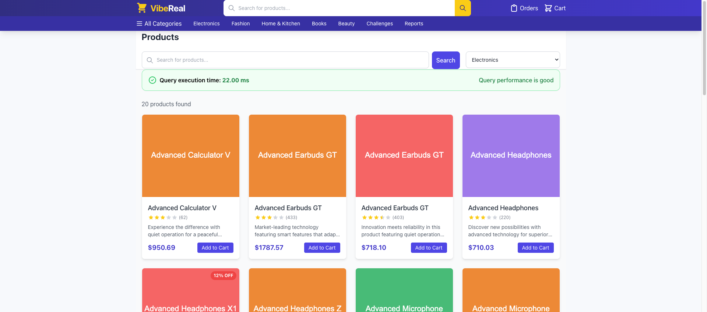
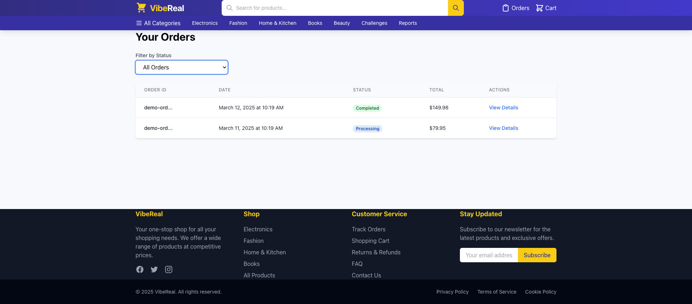
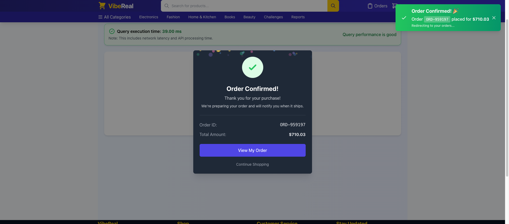
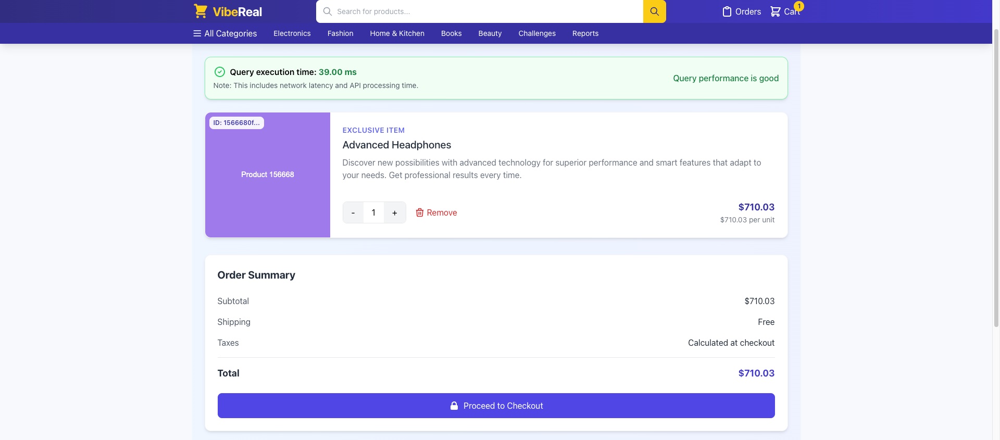
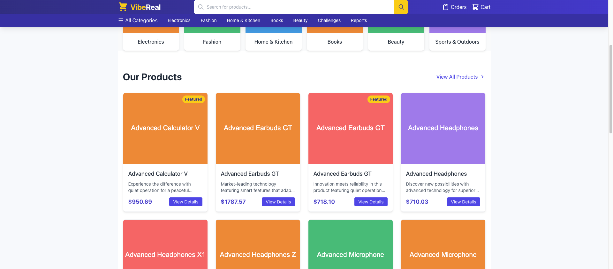

# 🚀 ViberEal: The PostgreSQL Performance Panic Room


> "Where database queries go to die... and then get resurrected!" 💀➡️😇

## 🤔 What Is This Madness?

Welcome to the most entertaining way to discover why your database queries are crawling! ViberEal is an interactive e-commerce platform *intentionally designed to be terrible* at database performance. Think of it as a haunted house, but for SQL queries.

**Perfect for:**
- Junior devs who've never seen a production fire 🔥
- Mid-level engineers who want to flex their optimization muscles 💪
- Senior devs with PTSD from that one time the database went down during Black Friday sales 😱

## 🎮 How to Play This Horrible Game

1. **Find the slow parts** - The app is full of performance landmines. Your mission: don't lose a limb!
2. **Figure out why they're slow** - Is it missing an index? Poor query design? A sacrifice to the database gods?
3. **Fix them!** - Apply your optimization wizardry and watch those query times drop faster than your manager's jaw when you say "it's not a bug, it's a feature."

## ✨ Features (or "Things That Will Break Your Soul")

- **Real-World E-commerce Hell**: A complete shopping platform with products, orders, carts, and users... all waiting to test your patience!
- **Performance Metrics**: Watch in horror as simple queries take longer than your coffee break
- **Interactive Challenges**: 10+ scenarios designed to make you question your career choices
- **Before & After**: See your optimization magic work in real-time (or cry trying)
- **Guided Solutions**: When you're ready to wave the white flag, we've got your back

## 📸 Screenshots (The Evidence of Pain)

Here's what you're getting yourself into:

### Homepage & Product Browsing

*The calm before the storm - a beautifully designed frontend hiding performance disasters*

### Product Details with Performance Metrics

*Witness the execution time of queries in real-time - feel the pain*

### Shopping Cart & Checkout

*Cart performance so bad your customers might just abandon their purchase*

### Order Management

*Where orders go to get lost in inefficient queries*

### Database Optimization Challenges

*Your playground for fixing the unfixable - good luck, you'll need it*

## 🏃‍♂️ Getting Started (A.K.A. "Your First Mistake")

### Prerequisites

- Docker & Docker Compose (because we're not monsters who make you install Postgres locally)
- A sense of humor (you'll need it)
- Coffee ☕ (lots of it)


### Accessing the Chaos

- 🛍️ **Shopping Site**: [http://localhost:8080](http://localhost:8080)
- 🔌 **API**: [http://localhost:3000](http://localhost:3000)
- 🔍 **PgAdmin**: [http://localhost:5050](http://localhost:5050) (email: admin@pgperformance.com, password: admin)
- 🗄️ **Database**: `postgres:5432` (username: postgres, password: postgres)

## 🎯 Performance Challenges That Will Make You Question Everything

1. **"The Infinite Scroll of Doom"**: Why does loading products feel like waiting for Windows 98 to boot?
2. **"Cart Abandonment Issues"**: Is your shopping cart slower than a sloth on sleeping pills?
3. **"The Order That Never Arrives"**: Find out why processing orders is taking longer than actual shipping
4. **"Search & Destroy"**: Text search queries that could be beaten by a carrier pigeon
5. **"Report-ocalypse"**: Analytics queries so slow they might finish by your retirement

## 🔧 Troubleshooting Guide (or "Common Ways People Break Things")

### The Entire App is Down
Did you remember to sacrifice a mechanical keyboard to the Docker gods? Try:
```bash
docker-compose down
docker-compose up -d
```

### Database Connection Issues
When in doubt, nuke it from orbit:
```bash
docker-compose down -v  # Warning: This erases your database!
docker-compose up -d    # Fresh start, like your first day at work
```

### PgAdmin Can't Connect to Postgres
Try using `postgres` as the hostname instead of `localhost`. Docker networking is fun like that!

### "It's Still Slow After My Fix!"
That's not a bug, that's a feature! Some challenges have multiple optimization pathways. Keep digging!

## 🧑‍💻 Development Tips for the Brave

```
frontend/      # React app - where the pretty UI lives
backend/       # Node.js API - the middleware that connects UI to DB
database/      # SQL init scripts - where all the performance crimes happen
```

## 🎓 Lessons You'll Learn (The Hard Way)

- Indexing isn't just for books
- Transactions are important (and expensive)
- JOINs are not always your friends
- The importance of EXPLAIN ANALYZE (your new best friend)
- Why database optimization should be part of initial development, not an afterthought

## 🙏 Credits & Thanks

Built with ❤️, 😭, and copious amounts of caffeinated beverages by developers who've seen things... terrible things... in production databases.

## ⚖️ License

MIT License - Feel free to use this to torture, I mean train, your team!

---

> "If debugging is the process of removing bugs, then programming must be the process of putting them in." - Edsger W. Dijkstra 
