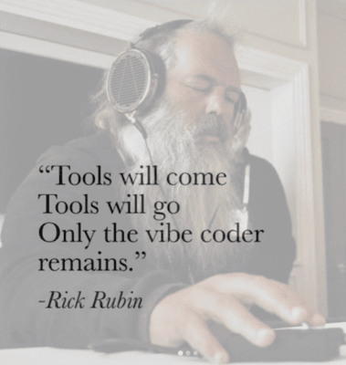

# 🚀 VibeReal: The Terrible E-commerce Platform



> "Where database queries go to die... and then get resurrected!" 💀➡️😇

## 🤔 What Is This Madness?

**Ever wanted to tackle real-world database hiccups without the pressure?** This platform gives you the chance to dive into scenarios you might not have faced yet. As you troubleshoot and fix issues, you'll see the impact right away, giving you that satisfying "aha!" moment as you turn this platform from a performance mess into a smooth-running machine. Along the way, you'll pick up valuable insights and experience that will gear you up for real-world challenges.

VibeReal is an interactive e-commerce playground designed to stretch your database performance skills. It's intentionally crafted to be a bit of a mess, offering a unique chance to learn and improve.

**Perfect for:**
- Developers eager to experience real-world database performance challenges in a safe and controlled environment.
- Those looking to enhance their skills by encountering and solving issues they might not face in smaller projects or freelance/outsource roles.
- Anyone interested in learning how to optimize database queries and improve application performance through hands-on practice.

## 🎮 How to Play This Horrible Game

1. **Find the slow parts** - The app is full of performance landmines. Your mission: don't lose a limb!
2. **Figure out why they're slow** - Is it missing an index? Poor query design? A sacrifice to the database gods?
3. **Fix them!** - Apply your optimization wizardry and watch those query times drop faster than your manager's jaw when you say "it's not a bug, it's a feature."

## ✨ Features (or "Things That Will Break Your Soul")

- **Real-World E-commerce Hell**: A complete shopping platform with products, orders, carts, and users... all waiting to test your patience!
- **Performance Metrics**: Watch in horror as simple queries take longer than your coffee break
- **Before & After**: See your optimization magic work in real-time (or cry trying)
- **Guided Solutions**: When you're ready to wave the white flag, we've got your back

## 📸 Screenshots (The Evidence of Pain)

Here's what you're getting yourself into:

### Homepage & Product Browsing

*The calm before the storm - a beautifully designed frontend hiding performance disasters*

### Product Details with Performance Metrics

*Witness the execution time of queries in real-time - feel the pain*

### Shopping Cart & Checkout

*Cart performance so bad your customers might just abandon their purchase*

### Order Management

*Where orders go to get lost in inefficient queries*

### Database Optimization Challenges

*Your playground for fixing the unfixable - good luck, you'll need it*

## 🏃‍♂️ Getting Started (A.K.A. "Your First Mistake")

### Prerequisites

- Docker & Docker Compose (because we're not monsters who make you install Postgres locally)
- A sense of humor (you'll need it)
- Coffee ☕ (lots of it)


### Accessing the Chaos

- 🛍️ **Shopping Site**: [http://localhost:8080](http://localhost:8080)
- 🔌 **API**: [http://localhost:3000](http://localhost:3000/api)
- 🔍 **PgAdmin**: [http://localhost:5050](http://localhost:5050) (email: admin@pgperformance.com, password: admin)
- 🗄️ **Database**: `postgres:5432` (username: postgres, password: postgres)

## 🎯 Performance Challenges That Will Make You Question Everything

1. **"The Infinite Scroll of Doom"**: Why does loading products feel like waiting for Windows 98 to boot?
2. **"Cart Abandonment Issues"**: Is your shopping cart slower than a sloth on sleeping pills?
3. **"The Order That Never Arrives"**: Find out why processing orders is taking longer than actual shipping
4. **"Search & Destroy"**: Text search queries that could be beaten by a carrier pigeon
5. **"Report-ocalypse"**: Analytics queries so slow they might finish by your retirement

## 🔧 Troubleshooting Guide (or "Common Ways People Break Things")

### The Entire App is Down
Did you remember to sacrifice a mechanical keyboard to the Docker gods? Try:
```bash
docker-compose down
docker-compose up -d
```

### Database Connection Issues
When in doubt, nuke it from orbit:
```bash
docker-compose down -v  # Warning: This erases your database!
docker-compose up -d    # Fresh start, like your first day at work
```

### PgAdmin Can't Connect to Postgres
Try using `postgres` as the hostname instead of `localhost`. Docker networking is fun like that!

### "It's Still Slow After My Fix!"
That's not a bug, that's a feature! Some challenges have multiple optimization pathways. Keep digging!

## 🧑‍💻 Development Tips for the Brave

```
frontend/      # React app - where the pretty UI lives
backend/       # Node.js API - the middleware that connects UI to DB
database/      # SQL init scripts - where all the performance crimes happen
```

## 🎓 Lessons You'll Learn (The Hard Way)

- Indexing isn't just for books
- Transactions are important (and expensive)
- JOINs are not always your friends
- The importance of EXPLAIN ANALYZE (your new best friend)
- Why database optimization should be part of initial development, not an afterthought

## 🙏 Credits (Blame These People)

Built with 💀, ☕, and AI-generated "vibe coding" by devs who've forgotten what human code looks like.
